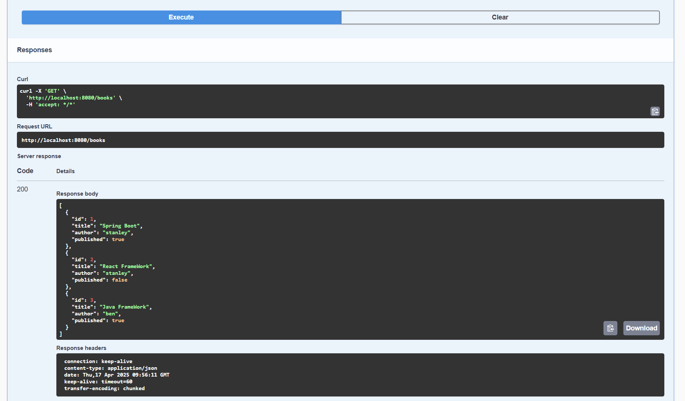

# README 

## Setting up the project

1. Download Eclipse IDE or Spring Tools Suite(STS).

2. After cloning this project from Github to your local drive, import it as existing maven project in Eclipse/STS.

3. Right-click on your project then go to 'Run as' -> 'Maven install'. (If necessary, go to Maven -> Update Project)

4. After it is built successfully, go to Spring Boot Dashboard to start your application or right-click on your project and 'Run as' -> 'Spring Boot App'.

## Calling API

1. After the application is started, go to localhost:8080/swagger to test the API's.

2. Under book-controller, click on an API such as GET /books and click 'Try it out'.

3. Enter any optional parameters then click 'Execute'.

4. You should have a response such as in the following screenshot.

# Running Test Cases

1. Find the file 'BookControllerTest' in /src/main/test.

2. Right-click on the file and 'Run as' -> 'JUnit Test'.